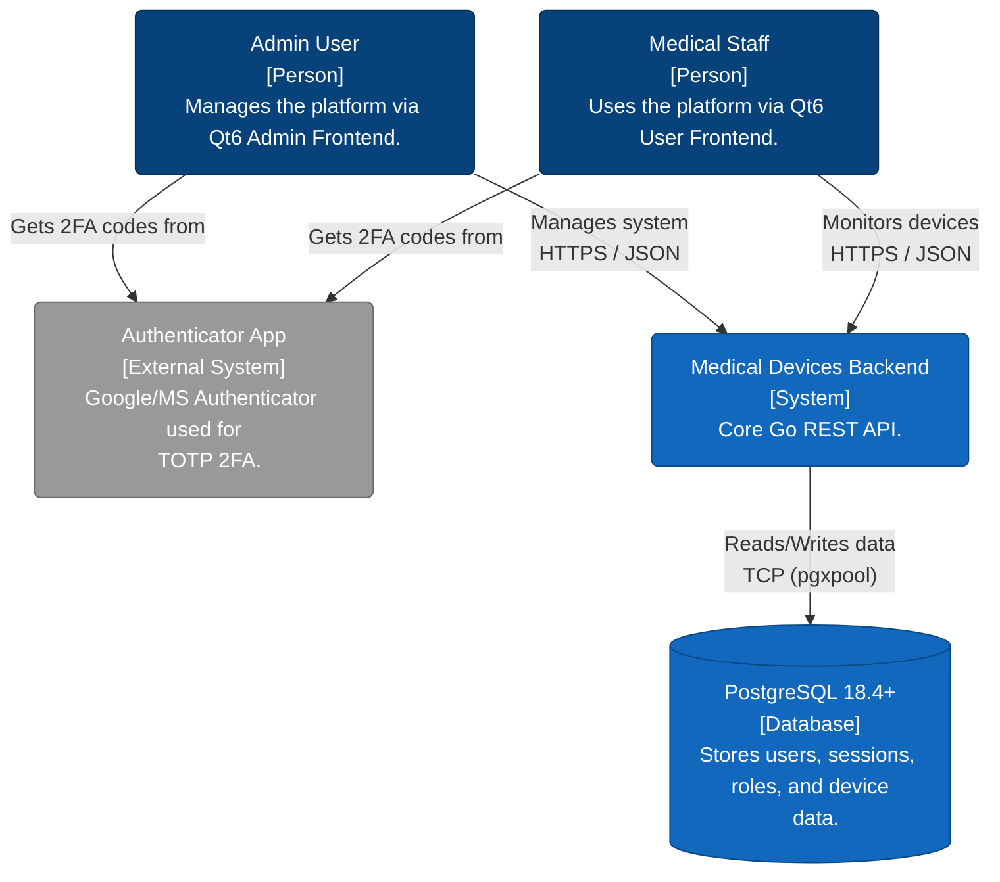

# Medical Devices Backend (`md_be_wserver`)

The **Medical Devices Backend** (`md_be_wserver`) is a highly secure, high-performance RESTful API server written in Go. It serves as the central control instance for managing medical devices, built primarily to support Qt6/C++23 frontends.

This backend enforces strict security mechanisms out of the box, including Argon2Id password hashing, AES-256-GCM encrypted configurations, JSON Web Tokens (JWT) for stateless sessions, and Time-Based One-Time Password (TOTP) 2FA integration.

## 🚀 Features

- **High-Performance HTTP Server**: Minimal dependencies, fast routing, and connection pooling.
- **Advanced Security & Authentication**:
  - Argon2Id password hashing.
  - JWT-based authentication (short-lived access tokens, persistent refresh tokens).
  - Mandatory password change on first login.
  - Integrated TOTP (Time-Based One-Time Password) Support (Google/Microsoft Authenticator) with QR Code generation.
  - Rate limiting, body limits, and lockout mechanisms against Brute-Force attacks.
- **Encrypted Configuration**: JSON configuration files are encrypted using `AES-256-GCM`. Included `encrypt-config` CLI tool.
- **Robust Database Layer**: PostgreSQL v18.4+ integration using `pgxpool`.
- **Role-Based Access Control (RBAC)**: Ready-to-use schema for managing Roles, Permissions, and dynamic User Assignments.
- **Zero CGO**: Statically compiled binaries (`CGO_ENABLED=0`) for maximum portability on Linux AMD64 systems.

## 📐 Architecture & Context



## 🛠 Prerequisites

- **Go**: 1.26 or higher
- **PostgreSQL**: 18.4 or higher
- **Make/Bash** (for build scripts)

## 📦 Build Instructions

All binaries are strictly compiled without CGO for the Linux AMD64 architecture.

You can use the provided build script:

```bash
./build.sh
```

Or build manually:

```bash
CGO_ENABLED=0 GOOS=linux GOARCH=amd64 go build -ldflags="-s -w -X main.version=1.0.0" -o ./bin/md_be_wserver ./cmd/md_be_wserver
```

_Compiled binaries will be placed in the `bin/` directory._

## ⚙️ Configuration

The server expects a configuration file (`md_be_wserver_config.json`). The server reads this file securely utilizing a master password provided at startup.

To encrypt a plaintext JSON config:

```bash
./bin/encrypt-config -in data/md_be_wserver_config.json -out data/md_be_wserver_config.json.enc
```

To run the backend server:

```bash
./bin/md_be_wserver -config=data/md_be_wserver_config.json.enc -password="<your-master-password>"
```

## 🔒 API Endpoints Overview

| Endpoint                       | Method | Auth Required | Description                                         |
| ------------------------------ | ------ | ------------- | --------------------------------------------------- |
| `/api/v1/auth/login`           | POST   | No            | Authenticate user, returns JWT and Refresh Token.   |
| `/api/v1/auth/refresh`         | POST   | No            | Issue new JWT using valid Refresh Token.            |
| `/api/v1/auth/logout`          | POST   | Yes           | Revokes the current session refresh token.          |
| `/api/v1/auth/change-password` | POST   | Yes           | Updates user password (enforced on first login).    |
| `/api/v1/auth/totp/setup`      | POST   | Yes           | Generates 2FA Secret and Base64 PNG QR Code.        |
| `/api/v1/auth/totp/verify`     | POST   | Yes           | Verifies initial code to enable 2FA on the account. |

_(More device-specific endpoints to be documented)._

## 📜 License & Third-Party Notices

This project is licensed under the **Apache License, Version 2.0**.

For a complete list of used Open Source libraries and their respective licenses, please refer to the `NOTICE` file in this repository.
